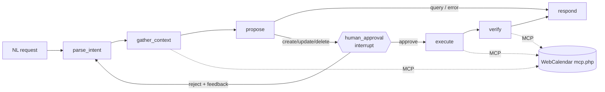

# scheduling-agent

A Python/LangGraph agent that turns natural-language scheduling
requests ("set up a recurring standup with the team, avoiding
Fridays") into validated, RFC 5545-compliant calendar events written
to a live [WebCalendar](https://github.com/craigk5n/webcalendar)
instance via MCP — with human approval before every write, an eval
suite for RRULE/DST correctness, and full tracing.

**Status: Phases 0–4 complete** — agent core, MCP tools (merged into
[WebCalendar](https://github.com/craigk5n/webcalendar) via
[#668](https://github.com/craigk5n/webcalendar/pull/668)), eval suite,
observability, chaos tests, CLI + web UI, and Docker. Everything is
tested offline (**156 tests, 100% coverage**; ruff, mypy `--strict`,
bandit). The one deferred piece is verification against a **live**
calendar instance. Docs:

- [docs/PRD.md](docs/PRD.md) — goals, requirements, decisions, risks
- [docs/ARCHITECTURE.md](docs/ARCHITECTURE.md) — system design, agent
  graph, model provider abstraction, MCP tool surface, eval design
- [docs/SCHEMA_AUDIT.md](docs/SCHEMA_AUDIT.md) — WebCalendar recurrence ↔ RRULE
- [docs/CHAOS.md](docs/CHAOS.md) — MCP fault tolerance (k5n-mcp-hub)
- [docs/TASKS.md](docs/TASKS.md) — phased task list

## The short version



- **Orchestration:** LangGraph — stateful graph, SQLite checkpointing,
  a human-in-the-loop interrupt before every write, and a reject→replan
  loop.
- **Models:** pluggable via `MODEL_PROVIDER` — Anthropic API key,
  OpenRouter, an Anthropic Pro/Max plan via the `claude` CLI, or a **local
  model** through **ollama** / **LM Studio** (OpenAI-compatible, no API
  key). Structured output goes through one provider-agnostic
  validate-and-repair loop, so no model needs tool-calling or MCP support
  — the graph does orchestration in code and the model only maps
  natural language to a validated `ScheduleProposal`.
- **Correctness:** every recurrence is built and validated against the
  exact subset WebCalendar can store/expand (a Python twin of the PHP
  validator), with DST-correct expansion previews via `dateutil`.
- **Backend:** WebCalendar's MCP server (`mcp.php`), extended with
  availability, conflict-detection, and recurrence tools.
- **Related repos:** [webcalendar](https://github.com/craigk5n/webcalendar),
  [k5n-mcp-hub](https://github.com/craigk5n/k5n-mcp-hub),
  [php-icalendar-core](https://github.com/craigk5n/php-icalendar-core)

## Usage

```bash
uv sync
cp .env.example .env        # then fill in MODEL_PROVIDER + its key, MCP_URL, MCP_TOKEN
uv run scheduling-agent     # or: uv run python -m scheduling_agent
```

You describe what to schedule; the agent plans, shows you a proposal
(with the recurrence expanded and any conflicts flagged), and **waits
for your approval** before writing anything. Type `quit` to exit.

Web UI (same graph, `POST /schedule` + `POST /approve` + a chat page):

```bash
uv run scheduling-agent-web         # http://localhost:8000
```

Or the whole stack in Docker (agent + WebCalendar; add `--profile chaos`
for k5n-mcp-hub fault injection):

```bash
docker compose up --build
```

Everything runs offline in tests via an in-memory calendar and a fake
model, so no API key or live instance is needed to develop.

### Observability

Structured JSON logs carry a per-conversation `correlation_id`. Set
`LANGSMITH_TRACING=true` + `LANGSMITH_API_KEY` to trace every graph run
in LangSmith (the startup line reports whether tracing is on).

## Evals

A golden dataset (`src/scheduling_agent/evals/cases.yaml`, 20 cases —
recurrence, avoid-Fridays constraints, BYSETPOS, DST spring-forward/
fall-back, update/delete/query) is scored by deterministic checks
(RRULE validity, occurrence expansion, weekday constraints, DST
local-hour, conflict awareness).

```bash
uv run python -m scheduling_agent.evals --mode reference   # no LLM; runs in CI
uv run python -m scheduling_agent.evals --mode agent        # measures a real provider
```

Reference mode gates CI (any regression fails) and uploads a
JSON + markdown report artifact. Agent mode runs the real graph against
your configured provider to measure model quality.

## Configuration

All credentials come from the environment (`.env`, gitignored); see
[.env.example](.env.example) for the variable **names** (no values).
Live-calendar URLs, tokens, and API keys are never committed.

| Variable | Purpose |
|---|---|
| `MODEL_PROVIDER` | `anthropic` \| `openrouter` \| `claude-subscription` \| `ollama` \| `lmstudio` |
| `ANTHROPIC_API_KEY` / `OPENROUTER_API_KEY` / `CLAUDE_CODE_OAUTH_TOKEN` | credential for the selected provider (local providers need none) |
| `MODEL_NAME` | model tag/id (e.g. `qwen2.5:32b` for ollama); optional |
| `OLLAMA_BASE_URL` / `LMSTUDIO_BASE_URL` | override the local endpoint (defaults `:11434/v1` / `:1234/v1`) |
| `MCP_URL` / `MCP_TOKEN` | WebCalendar `mcp.php` endpoint + API token |

> **Local models & structured output:** `ollama`, `lmstudio`, and
> `openrouter` use **native `json_schema` structured output** when the model
> supports it — the model is constrained to emit a valid `ScheduleProposal`,
> which is far more reliable than free-text. If the model/server doesn't
> support it, the agent automatically falls back to the validate-and-repair
> loop (the subscription CLI always uses the loop). Support is **per model**:
> use a structured-output-capable one — e.g. **Qwen2.5**, **Llama-3.1/3.2**,
> **Mistral-Nemo**, **Command-R**, **Hermes** (in LM Studio, look for the
> "tool use" badge). Small/base models may struggle with the schema and RRULE
> reasoning regardless — measure any model with
> `python -m scheduling_agent.evals --mode agent`.

## Design decisions

- **Validate recurrence before sending.** `rrule.py` is a Python twin of
  WebCalendar's server-side validator, derived from a
  [schema audit](docs/SCHEMA_AUDIT.md) of `webcal_entry_repeats`. The
  agent never proposes a rule the backend can't store/expand.
- **HITL is a real graph interrupt.** Writes pause at a LangGraph
  `interrupt`; state is checkpointed to SQLite, so an approval survives a
  process restart (proven in tests). Rejections loop back and replan.
- **One repair loop for all providers.** Structured output is produced by
  a provider-agnostic validate-and-repair loop rather than native tool
  calling, so the Pro/Max subscription backend works on equal footing —
  and provider differences become a measured eval number, not a bug class.
- **GMT at the tool boundary.** The scheduling MCP tools operate in the
  storage frame; the agent owns local↔GMT (with DST-correct expansion),
  keeping the PHP side simple.
- **Direct JSON-RPC client.** `mcp.php`'s HTTP transport is custom
  JSON-RPC (not standard-MCP), so a small httpx client fits better than
  `langchain-mcp-adapters`. Every transport/protocol fault is wrapped
  into one `McpError` ([chaos-tested](docs/CHAOS.md)).
- **Evals split for a keyless CI.** Deterministic scorers gate CI over a
  golden dataset (20/20); a real provider is measured opt-in via
  `--mode agent`.

**Known v1 limitations (documented):** one-off `create` events are stored
untimed (the `add_event` MCP tool takes no time yet); availability and
conflict checks don't expand recurring occurrences past the base date.
Both are slated for a backend follow-up and are what live-instance eval
runs will quantify.

## Development

```bash
uv sync                    # create the venv (Python 3.12) and install deps
scripts/install-hooks.sh   # one-time: run the gate automatically on git push
```

### Run CI locally

`scripts/ci.sh` is the single source of truth — GitHub Actions runs the
exact same script, so local checks and CI can't drift.

```bash
scripts/ci.sh              # full gate: ruff, format, mypy, bandit, pytest+coverage
scripts/ci.sh test         # a single stage: lint | format | type | security | test
```

Once hooks are installed, the full gate also runs on every `git push`
and blocks it on failure (bypass in a pinch with `git push --no-verify`).

## License

[MIT](LICENSE) © 2026 Craig Knudsen.
